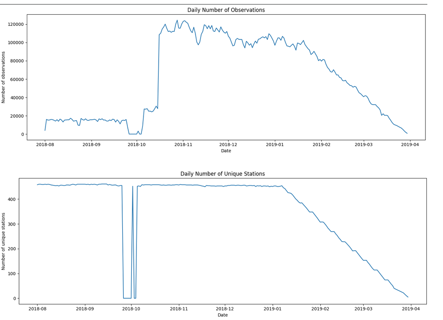
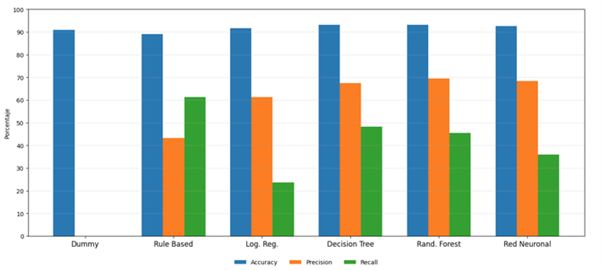
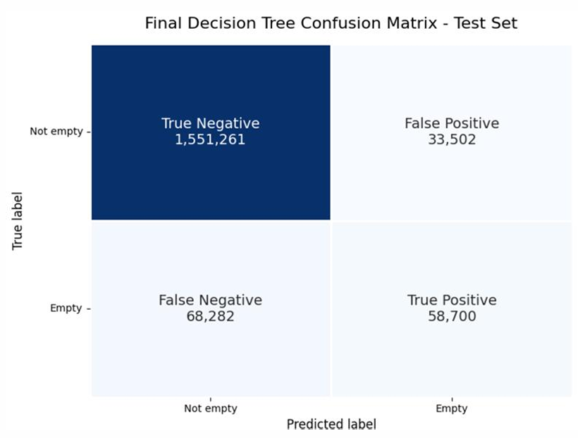
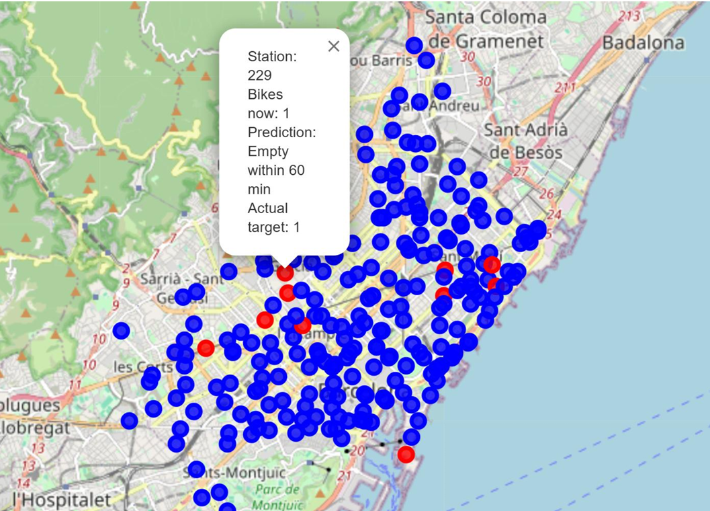
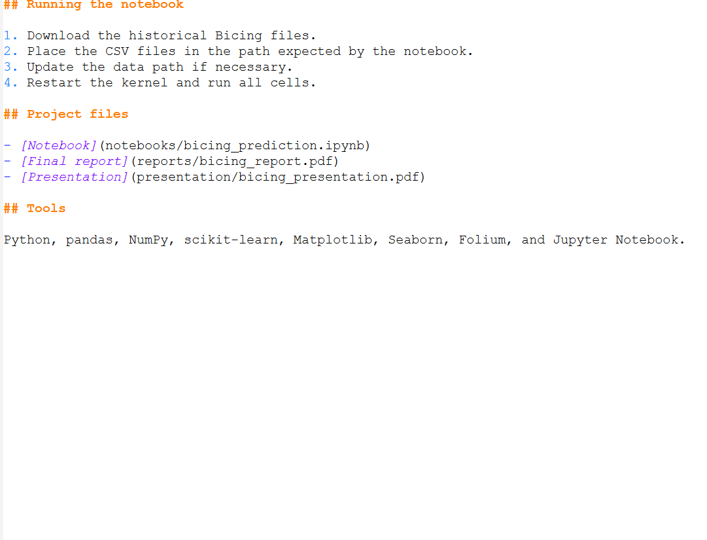

# Predicting Bicing Station Empty Risk Within 60 Minutes

An end-to-end machine learning project that predicts whether a Barcelona Bicing station will become empty within the next 60 minutes.

The project uses more than **24 million historical station-status snapshots** and combines current availability, recent station history, temporal variables, and location information.

<p align="center">
  
</p>

## Project overview

The task is formulated as a binary classification problem:

- **1:** the station becomes empty at least once during the following 60 minutes while it remains open.
- **0:** the station does not become empty during that period.

Only observations from open stations with at least one available bicycle are considered eligible for prediction.

## Data source

Official source:

https://opendata-ajuntament.barcelona.cat/data/es/dataset/bicing

The analysis covers historical Bicing station-status data from **August 2018 to March 2019**. The raw files are not included because their total size is several gigabytes.

## Data coverage

The dataset initially contained approximately **24.4 million observations**.

<p align="center">
  
</p>

March was excluded from the main evaluation because station coverage declined severely and the target distribution was no longer comparable with earlier months.

## Feature engineering

### Current station conditions
- Available bicycles
- Free slots
- Observed station capacity
- Occupancy ratio

### Recent history
- Bicycles available approximately 15 and 30 minutes earlier
- Change in bicycle availability during the previous 15 and 30 minutes

### Time and location
- Hour of day
- Day of week
- Weekend indicator
- Month
- Latitude
- Longitude

## Temporal validation strategy

| Dataset | Period | Observations | Positive rate |
|---|---|---:|---:|
| Train | August–December 2018 | 9,521,722 | 9.00% |
| Validation | January 2019 | 2,966,095 | 9.11% |
| Test | February 2019 | 1,711,745 | 7.42% |

Because only around **9%** of observations were positive, accuracy was not interpreted in isolation.

## Models compared

1. Dummy Classifier
2. Rule-Based Baseline
3. Logistic Regression
4. Decision Tree
5. Random Forest
6. Neural Network

<p align="center">
  
</p>

## Final model

The **Decision Tree** was selected because it provided the most suitable balance between precision and recall.

| Metric | Test result |
|---|---:|
| Accuracy | 94.05% |
| Precision | 63.66% |
| Recall | 46.23% |

<p align="center">
  
</p>

The model detected approximately **46% of the stations that actually became empty**. When it predicted that a station would become empty, approximately **64% of those predictions were correct**.

## Prediction map

<p align="center">
  
</p>

- Red markers: predicted to become empty within 60 minutes
- Blue markers: predicted not to become empty

## Error analysis

False positives generally occurred when stations had few bicycles and showed a strong recent downward trend. False negatives tended to occur when stations still appeared relatively safe but experienced a rapid decline afterwards.

<p align="center">
  
</p>

## Main findings

- The Rule-Based Baseline achieved the highest recall but generated many false alarms.
- Random Forest achieved slightly higher accuracy and precision.
- Decision Tree achieved better recall than Random Forest and was selected as the final model.
- Temporal data quality strongly affected model evaluation.

## Main limitations

- Data gap around late September and early October 2018
- Declining station coverage in later months
- Snapshot data instead of individual trip records
- No weather, holiday, event, or public transport variables

## Repository structure

```text
bicing-empty-station-prediction/
├── README.md
├── requirements.txt
├── notebooks/
│   └── bicing_prediction.ipynb
├── reports/
│   └── bicing_report.pdf
├── presentation/
│   └── bicing_presentation.pdf
├── data/
│   └── sample/
└── images/
    ├── project_overview.png
    ├── daily_coverage.png
    ├── temporal_split.png
    ├── model_comparison.png
    ├── confusion_matrix.png
    ├── prediction_map.png
    └── error_analysis.png
```

## Installation

```bash
pip install -r requirements.txt
```

## Running the notebook

1. Download the historical Bicing files.
2. Place the CSV files in the path expected by the notebook.
3. Update the data path if necessary.
4. Restart the kernel and run all cells.

## Project files

- [Notebook](notebooks/bicing_prediction.ipynb)
- [Final report](reports/bicing_report.pdf)
- [Presentation](presentation/bicing_presentation.pdf)

## Tools

Python, pandas, NumPy, scikit-learn, Matplotlib, Seaborn, Folium, and Jupyter Notebook.
